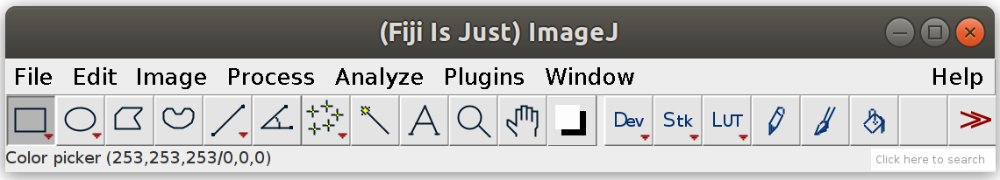
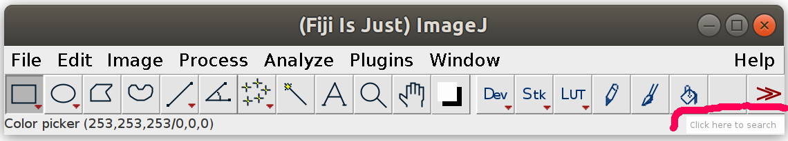
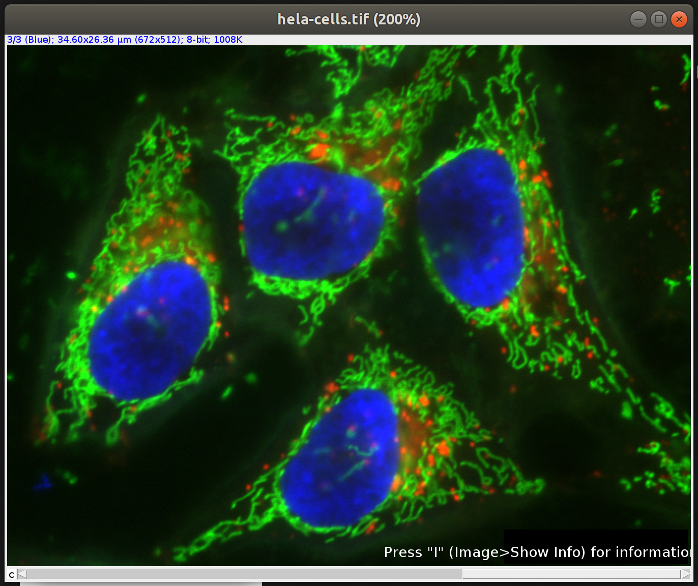
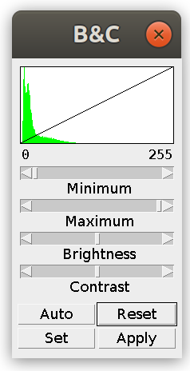
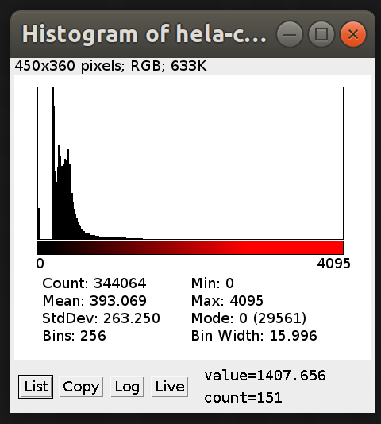

**Image analysis basics (pt1)**
Kyle Harrington, mdc@kyleharrington.com

# Getting setup

## HIPS

TBD

## Fiji

Download Fiji from
[https://imagej.net/Fiji/Downloads](https://imagej.net/Fiji/Downloads)

# Introduction

[Basic
concepts](https://datacarpentry.org/image-processing/01-introduction/index.html)
from Data Carpentry workshop  
[Pixels and file formats](https://datacarpentry.org/image-processing/02-image-basics/index.html)

# Getting started with Fiji

When you open Fiji you will get the following window:

There are a few efficient ways of using this:

1. Most functionality is made available through menus. For example
   try:
   `File>Open Samples>Blobs`
   
2. The search is available in the bottom right of the window.

Try typing `Blobs`

**Protip: when the Fiji window is active press the letter 'l' and this
will activate the window, then simply type whatever
command/plugin/etc. you want to use.**

Many of the example commands in this workshop will be listed as:  
`Fiji search: <some phrase>`

3. Finally there are some basic icons shown on the toolbar
   itself. These may be familiar from other image editing tools you've used.

## Image Representation

Pixels of an image may be represented in different ways. This relates
to how much *memory* is used by the image, and affects the range of
values that can be represented in pixels. 

- 8-bit (0-255), integer only
- 16-bit (0-65536), integer only
- 32-bit, floating point, decimal
- RGB, 32-bit with 8-bit for each color

There can be other pixel types with higher/lower resolutions and
representing different types of data, but these are the key types in Fiji.

**Activity:**

`Fiji search: hela cells`

Note that there is a horizontal scroll bar at the bottom of the screen
now which shows the currently active channel. This is for the red,
green, and blue channels of the image.

Note that the active channel is shown at the top of the image (in this
example in blue)

Also note, that as you move your mouse over the image the location and
pixel value is shown on the Fiji status bar:

`Fiji search: brightnesscontrast`

**Protip: if you lose the Fiji window but still have your image
window open, then press 'enter' and it will bring your Fiji window to
the top and activate it.**

You should get a window like this (the color may be different if you
played around with the channel selection scroll bar)

Adjust the channels to get a sense about how the visual representation
of the image changes. Note that as you adjust the
minimum/maximum/brightness/contrast the `value` of the pixel does not
change only the visual representation.

`Fiji search: histogram`

When you run the histogram on this image you have the option of either
taking the histogram of all channels together or the currently active channel.

This shows the distribution of pixel values in the image. Each bar is
a count of the number of pixels from the image with each pixel
value. Now note that the minimum is `0` but the maximum is not `255`
which is what we expect from an 8-bit image, instead it is
`4095`. However, look at the `Bins` there are only `256` bins, and
`2^8 = 256` so we are still only using 8-bits to represent each pixel
value, but the precision of each pixel's value is reduced. Instead of
being able to represent the values `0`, `1`, `2`, `3`, `4`, `5`, `6`,
..., `15`, we actually just store a `bin` that represents all values
between `0` and `15`. 
