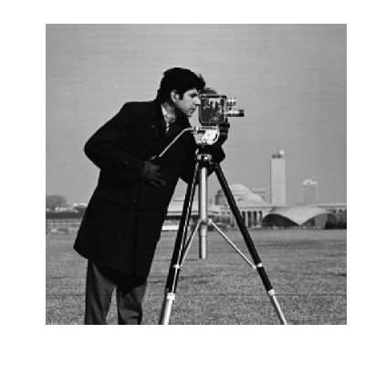
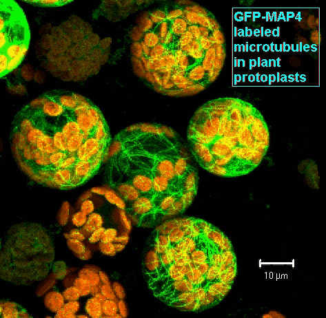

# Part 2: Basic Functions in Fiji

## Overview:

- Handling stack dimensions (x,y,z,t,ch): stacks & hyperstacks
- Manipulating stack dimensions: slice keeper/remover, split & Merge channels
- Projecting, reslicing & orthogonal views.
- Switching bit depths, look Up tables & their associated issues
- Adjusting brightness & histograms
- Show info (ctrl+i), Set scale, Set Measurements, Measure
- What is a filter?
- Mean, Median and Gaussian filters (smoothing/denoising)
- Edge detection - eg Soebel Filter
- Background removal
- Image calculations

## Link to talk

Pending

## Content:

So now we've got Fiji up and running, and opened some images, lets have a look at the basic controls and functions we can use.

### Handling stack dimensions

Often images in bioscience today are not just a simple 2-dimensional (X,Y) snapshot of intensity. Instead we often have to deal with 3, 4 or 5 dimensions in our images, that can include a depth dimension (Z), time (T) and different channels (C).

 

This can make the contents of our images hard to get our heads around, and hard to visualise on a 2D screen. Fiji has a number of approaches to help us with this.

The simplest is the *hyperstack*. A *stack* is just a sequence of 2D images and Fiji displays a stack with a scrollbar allowing you to move through them. A *hyperstack* in Fiji can have 2 or 3 scrollbars, each one allowing you to move along an additional dimension beyond the first 2 (X & Y). 

You can convert stacks to hyperstacks, and vice-versa, using the `Image>Hyperstacks>Stack to Hyperstack / Hyperstack to Stack` command:

and a quick look in `Image>Stacks>Tools` will show you a load of different ways to manipulate your image stack:

Manipulating stacks and hyperstacks is useful for handling Z-stacks &/or Time series data. With multi-channel data, we often want to move between overlaying the 2 channels in the same image, or viewing them separately. 

## Excercise:

1. Open sample Mitosis.tif (*File>Open Samples>Mitosis*).
3. Let's get a feel for the image: Use the scrollbars to move through the different Z-depths and Timepoints. Use the magnifier & hand tools to zoom in and move around the image.
4. How many dimensions does the stack have? What is the size of each dimension?
5. Zoom in far and select a individual voxel - can you give the coordinates of this voxel in all dimensions? What intensity does it have in each channel?
6. Go to frame *Z:3/5 T=3/51*
7. Use the *Image>Adjust>Brightness/Contrast* window to look at the histograms for both channels.
8. Adjust the *Maximum* and *Minimum* values to set the contrast how you like it.
9. Try clicking *Auto* to automatically set contrast levels and *Set* to manually input the Max and Min displayed levels.
10. So far we have only adjusted the brightness with which each intensity value is visualised on the screen. The raw pixel intensity values remain the same. Clicking *Apply* would change the intensity value of each pixel and rescale them with values from the Minimum to the Maximum according to the image bit depth. **Generally it is not advisable to *Apply* changes, as this changes the raw intensity values. This can lead to unreliable comparisons between images and information can be lost due to saturation.**
11. If in the last step you did click *Apply*, close the image and reopen Mitosis.tif
12. Duplicate the stack. It can be good practice to do this before each step as often there is no undo function. (use *Image>Duplicate* and tick the *Duplicate hyperstack* checkbox)
13. Let's get some info from the image metadata: With the image selected, click *Image>Show Info* or use *Ctrl+i*
14. What is the width and height of each pixel? what about the Z-depth between each slice?
15. In the info, the authors have added some info of their own about what has been imaged. It shows GFP-Aurora B and an mCherry-tubulin fusion protein. The colours (LUTs) in the image are, however, the reverse of the colours of the fluorescent proteins. Lets change that to make Channel 1 (GFP-Aurora B) green and Channel 2 (mCherry-tubulin) is magenta. Use the channel scroll bar to switch between channels and use *Image>Lookup Tables* to choose the color you want to use to display each channel.
16. A colleague tells you that there's an error in the metadata and the saved pixel size is incorrect. The correct pixel width and height is 0.1µm. Use *Image>Properties* to change it, and check that it worked by bringing up the image info (*Ctrl+i*)
17. Now let's reduce the image dimensionality by creating a maximum Z-projection (*Image>Stacks>Z-project*). Try this again with an averge projection and compare - what issues could each approach bring?
18. Let's split the channels so that we can work on one at a time. Use *Image>Color>Split Channels*
19. You want to describe changes in the spindle fibre during the build up to anaphase. Decide on 1 or 2 metrics to measure in order to carachterises this (eg spindle fibre length, area of the spindle fibre region, average intensity within that region, angle at the centrosome etc). Use *Analyse>Set Measurements* and make sure that the appropriate measurements are ticked (eg *Area* and *Mean gray value*. There is no tick box for length or angle, they are always ticked).
20. Now scroll through the Tubulin channel (C2) to establish which frame defines the onset of anaphase (eg frame 27). Then select 3 earlier frames to charachterise the build-up (eg 1, 13, 26). Using the selection tools (line tool, segmented line, angle, polygon etc), draw appropriate regions and then press *M* (or *Analyze>Measure*) to take measurements.
21. What do you think of the metrics you chose, and the approaches you took to measure them? Are they appropriate, are there biasses in your method?
22. Now look at the Aurora B channel (C1). We want to define an area where we say that Aurora B is localised. But there are some problems. Use the magnifier to zoom in on the Aurora B region. If you change the max brightness of the image (*Image>Adjust>Brightness/Contrast*), the area you that would define changes simply as a consequence of the visualisation. Also scroll through the different time-points and you will see that the intensity is not completely smooth, rather there is some noise.
23. Let's try to deal with the noise first. To see more clearly what we mean, use the line tool to draw a line across the length of the fluorescence, then press *K* (or *Analyze>Plot Profile*) to visualise the intensity profile along your line. (Hint: if you select *Live* you can move the line and see how it changes)
24. Now let's try some denoising. First duplicate your image (*Image>Duplicate* with *Duplicate stack* ticked) and then apply a Gaussian Blur. (*Process>Filters>Gaussian Blur..*). If you tick *preview* you can see how changing the sigma (the radius of the 2D gaussian) affects the result. When you're happy, click apply.
25. Go back to the original, duplicate it and now try a median filter (*Process>Filters>Median...*). What are the 2 filters doing, What differences are there between their effects? You could also visualise the difference they have made by plotting a line profile (draw a line and then click *K*).
