# Image analysis basics (pt3)

The concepts we aim to address in this section are focused on finding
and quantifying *things* in your images, where *things* may be cells,
particles, dogs, unicorns, stars, etc.. 

To begin, let's start with our trusty `blobs` image:

`Fiji search: blobs`

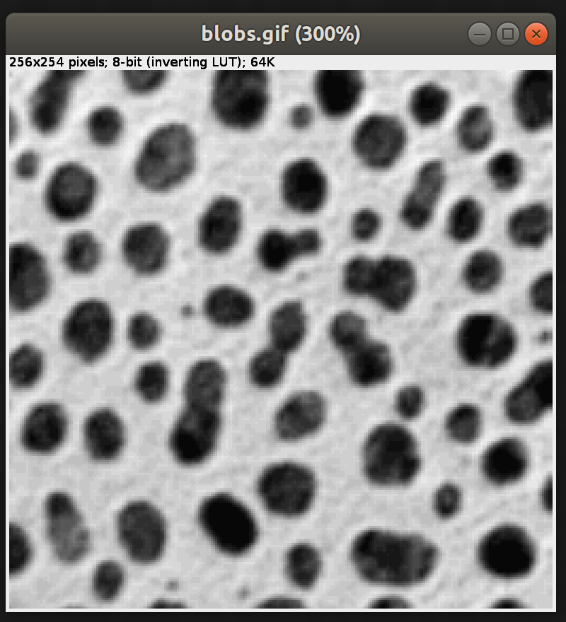

We see a collection of spots. How many spots are there? There are more
spots than fingers on our hands, so I'll have trouble counting
accurately. Let's do this the easy way!

## Thresholding

We want to threshold the image. This means we need to find a threshold
that allows us to say if a pixel belongs to one our blobs of interest
or not. 

`Fiji search: threshold`

Now we need to find a good threshold value. With this tool we can find
the threshold value either manually or automatically.

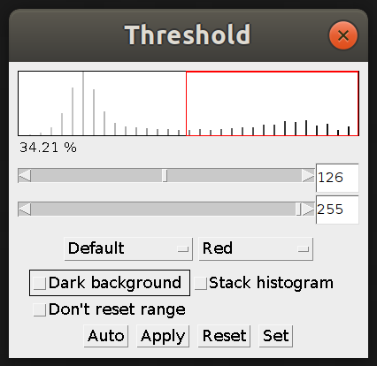

The sliders allow us to change the minimum and maximum value for
thresholding. However, we can also use an algorithm to automatically
find our threshold. 

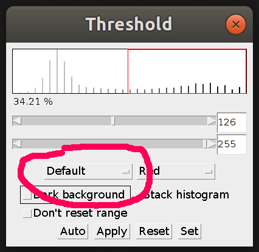

Press `Apply` to make a binary mask of the image.

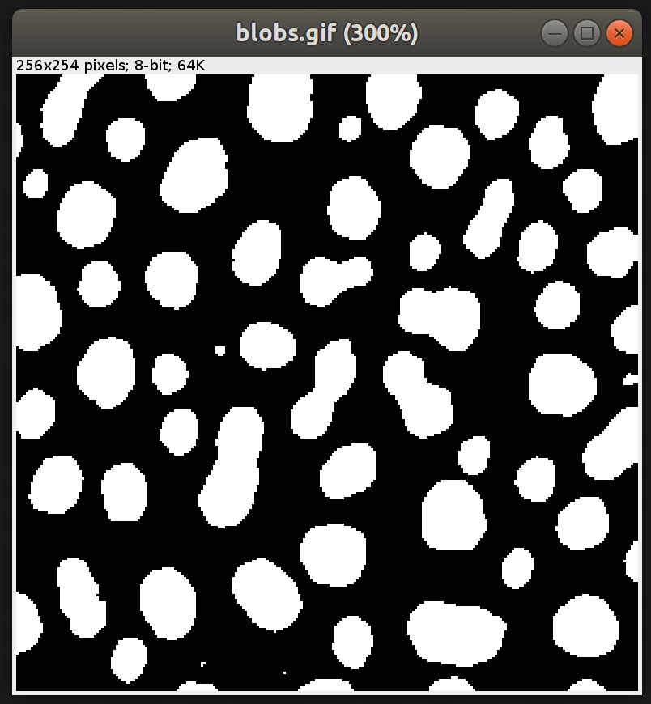

### Automatic thresholding

There are many algorithms for computing a threshold. Explanations of
the methods available in ImageJ [here](https://imagej.net/Auto_Threshold).

You can easily compare thresholding algorithms with the Auto Threshold
tool:

`Fiji search: auto threshold`

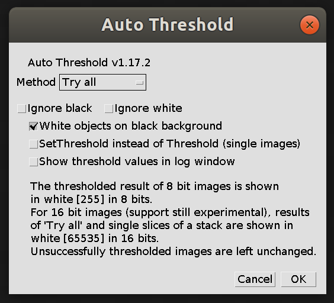

Now we can use the `Try all` option to create a montage of all of the
thresholding outputs.

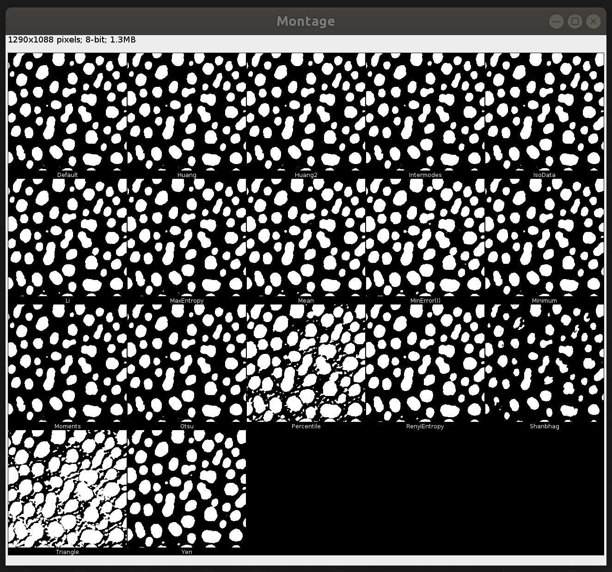

### Local thresholding

The previously described algorithms use global image statistics
(e.g. the histogram of the image) to calculate the threshold. However,
sometimes your image may have local variations that can cause problems
with such global methods. You can use the auto local threshold tool to
perform a similar comparison to the one we did for automatic
thresholding. Note that the `radius` is a key variable here. The
algorithms are essentially the same as the global thresholding
algorithms, but instead they operate on a sliding window with a size
defined by the `radius`.

`Fiji search: auto local threshold`

## Binary Operations: erode, dilate

Binary operations are ways of processing a binary image that can
facilitate taking some measurements of the things that you've detected
in your image.

Now let's make a duplicate of the binary image so we have a copy for
experimenting with.

`Fiji menu: Image>Duplicate`

Now let's `erode` the image.

`Fiji menu: Process>Binary>Erode`

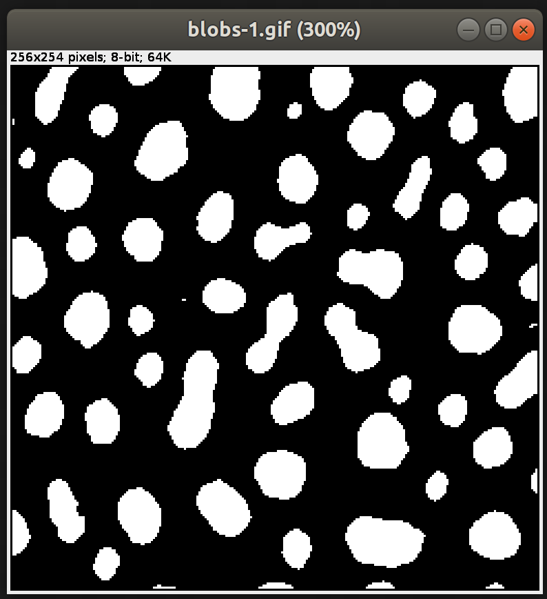

Our blobs have now gotten smaller, and some of the smallest objects
have disappeared. The erode operation removes the boundary pixels of
a binary object.

Now let's `dilate` that same image.

`Fiji menu: Process>Binary>Dilate`

Interestingly most of our blobs look almost like they did previously,
but the small blobs have disappeared. However, some shapes have become
more blocky. This is due to the fact that we lost some information
during the first erosion and we simply cannot recover it when we
perform the following dilation.

Let's inspect the difference.

`Fiji menu: Image>Color>Merge Channels`

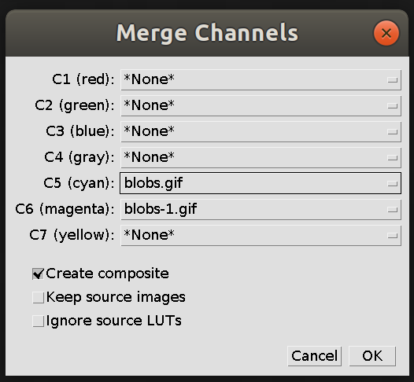

We end up with the following result, where we can see pixels that
belong to our original binary mask in cyan, and if there were any
pixels belonging to the processed binary mask then they would be shown
in magenta.

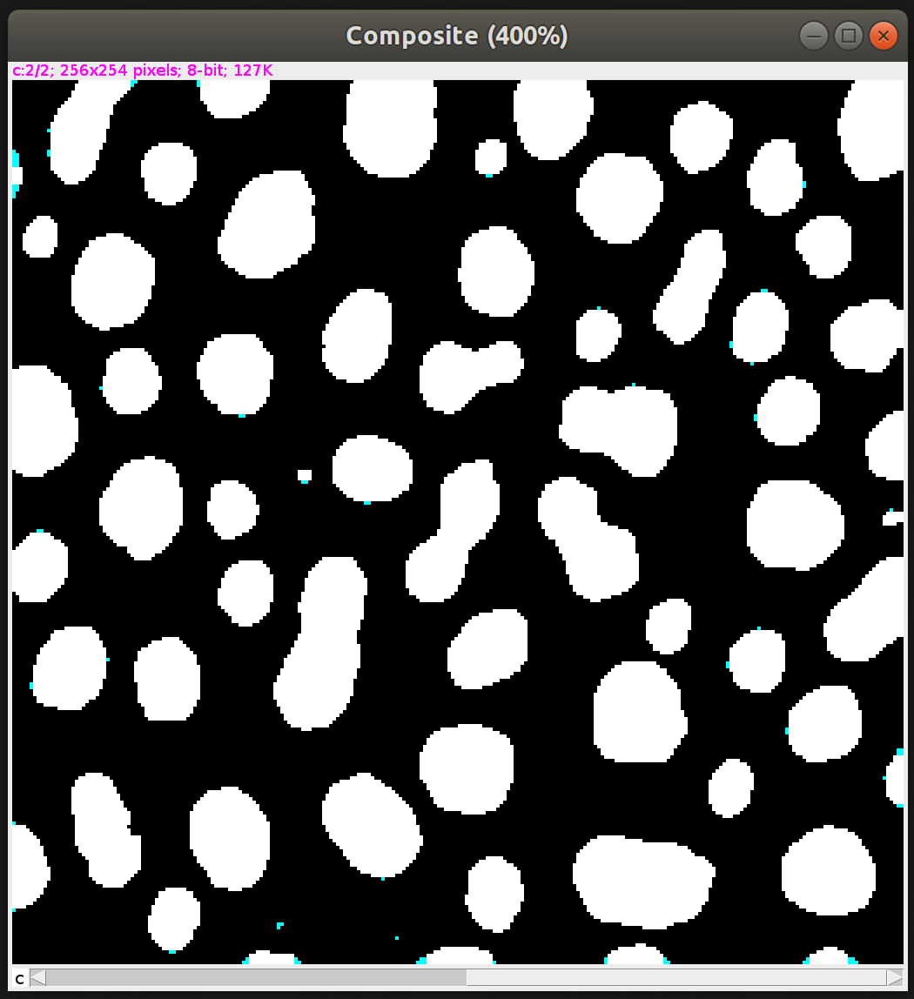

## Taking measurements

Now let's take some measurements.

`Fiji menu: Analyze>Analyze Particles`

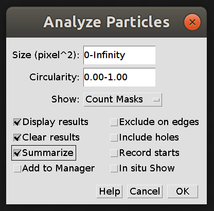

There are a few different things that we can do in this window that
are useful in practice. 

It is very common to want to filter your particles by their area. This
is a threshold on the number of pixels in the particle, where the
range `0-infinity` will include all possible particles.

We have checked a few options:

- `Display results` will display results for each particle that is
  measured
- `Summarize` will record summary statistics of particles measured in
  a given image. This can be useful for quickly comparing measurements between
  images. 
  
`Show` gives us a way to generate image outputs. It can be useful to
show `Count Masks` which stores the number of pixels in each particle
as the value of the mask. Try mousing over a small blob and a big blob
while looking at the pixel values in the status bar.

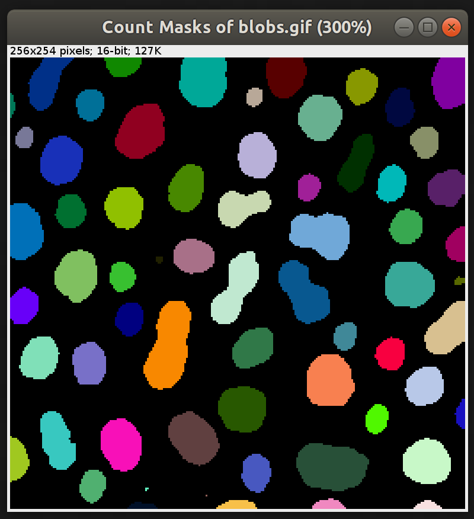

Here we have changed the color map of the count mask to the `glasby
invert` LUT. We do this by first selecting our image with the count
masks and then changing the `LUT` of the image.

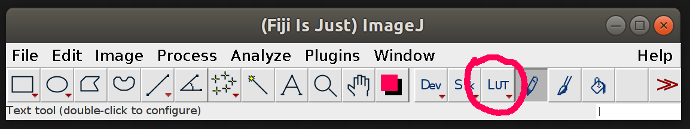

## Regions of interest

When we took our measurements we quantified a collection of
regions. This is a very common task in image processing. However, you
may just need to take a quick measurement of an object. Let's try the
magic wand tool!

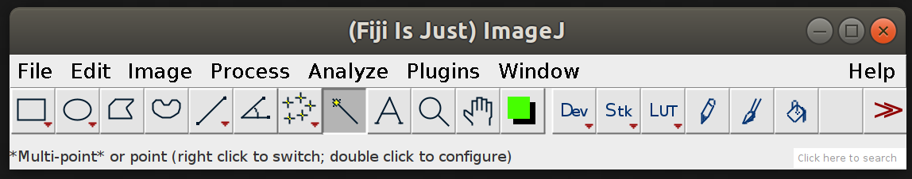

Now go back to the blob's image and click on your favorite blob. Did
you get the result you'd expect? Try double clicking on the wand icon
on the toolbar, now adjust the tolerance.

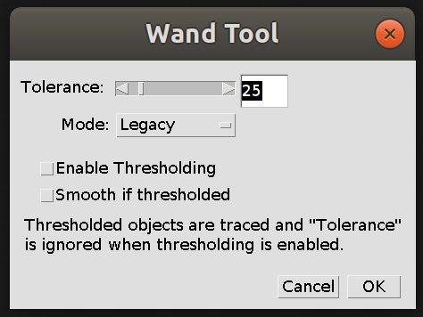

Now try clicking on your favorite blob again.

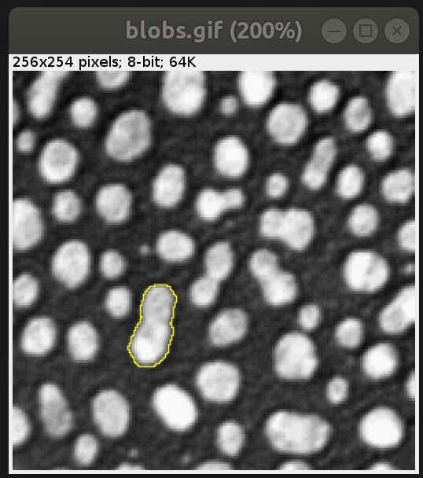

Now you can take a measurement

`Fiji menu: Analyze>Measure` or `Ctrl+m`

That will bring up a new window with a results able, but it might not
have all of the features that you actually want to measure. Let's
enable some more measurements:

`Fiji menu: Analyze>Set measurements...`

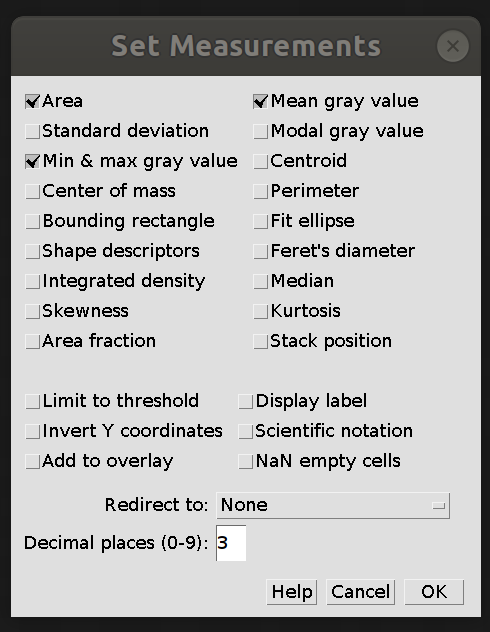

Now the next time you take a measurement these additional measures
will be calculated as well.

That selection you made in the Blobs image is called a Region of
Interest (ROI), and there are a lot of things that you can do with
ROIs. 

If you go back to your window with the Blobs image, and your favorite
blob is still selected, then try pressing `t`.

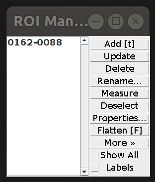

Once you have added a ROI into the ROI manager you can use it in other
images. Try opening a new image 

`Fiji menu: File>Open samples>Clown`

Now go back to the ROI manager and click on the ROI that was
added. You will see that the selection becomes highlighted in the new
image as well.

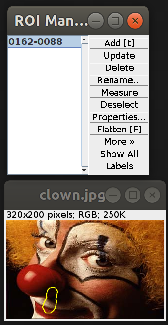

## Advanced binary

### Watershed

Let's go back to Blobs and run a simple threshold.

Now let's run what is called a watershed algorithm:

`Fiji search: watershed`

You'll see that a number of our large blobs have been split into
approximately even pieces around the narrow midpoint.

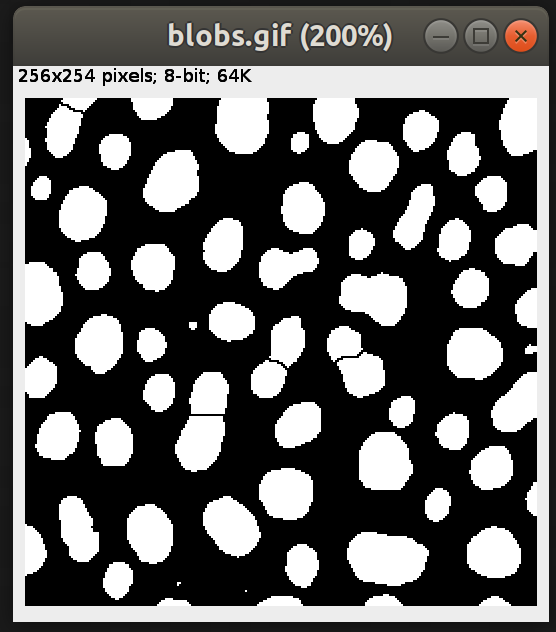

There is a more detailed explanation of the algorithm in the [Bankhead
book](https://petebankhead.gitbooks.io/imagej-intro/content/chapters/binary/binary.html). The
rough idea of the algorithm is that you think about the intensity of
an image as defining contour map of mountains and valleys, where dark
regions are valleys and bright regions are mountains. You fill this
map with water at specific locations, and when a region gets to the
point of overflowing into a neighbor you build a dam to maintain
separation. The locations where you start to fill the water are called
the `seed points`. In the default ImageJ watershed algorithm these
points are determined by the Euclidean distance transform.

### Skeletonize

Now let's try skeletonizing a neuron!

`Fiji menu: File>Open Samples>Neuron (5 channels)`

This image has 5 channels that you can inspect by moving the scroll
bar on the bottom of the screen. Let's split the channels into
separate images:

`Fiji search: split channels`

Now focus on the second channel `C2-Rat_Hippocampal_Neuron.tif`
window.

Now let's segment out the neuron:

`Fiji search: trainable weka segmentation`

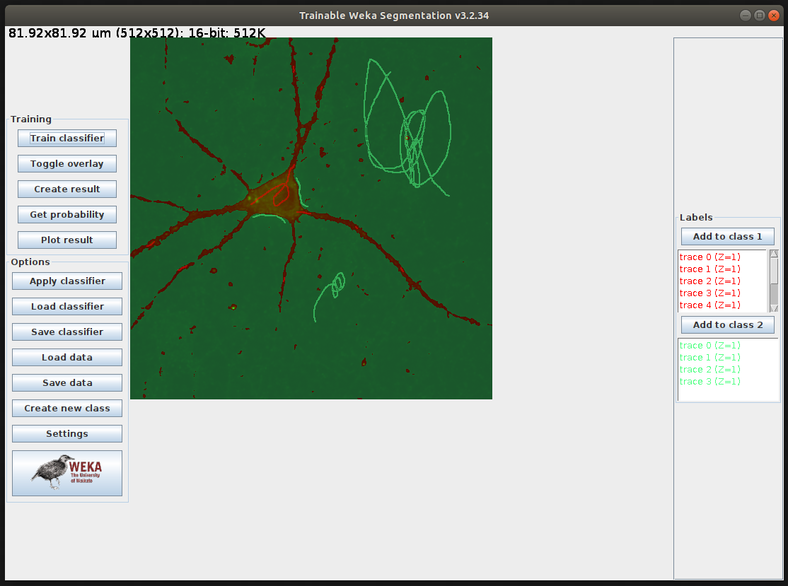

# References

- Pete Bankhead's [chapter on thresholding](https://petebankhead.gitbooks.io/imagej-intro)
